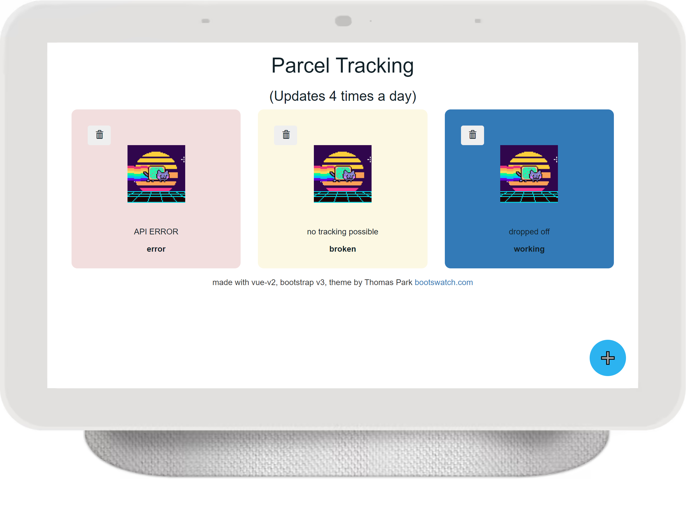

# Home Parcel Tracking

This Project is made to give you an overview of your traced parcels running locally on your server.
It uses publicly available APIs which are mostly undocumented to track the parcels.
It then shows you in a simple Dashboard what your parcels are up to.
Please read the steps below carefully.

# runner

This is the API backend and runs on NodeJS.
It does the tracking and managing of tracked parcels and could be used for alternative frontends or applications.

Requires `node 12+`

## How to use

### Installation

Clone the repository.  
Get to the `runner` folder.  
Run `npm i`.
Start the project runing `npm run start`.

### Deamonize

You can also choose to create a SystemD module like in [docs/systemd-sample.service](docs/systemd-sample.service).
A run script is chosen since there was an issue with running NodeJS application directly through the SystemD module.

## contributing

If you intend to contribute, please build your own up to date setup script for the frontend by running `npm run creator` in the `runner/` folder.
Please replace the old before opening a pull request.
Also check out the modules tracking modules docs [runner/tracking/docs.md](runner/tracking/docs.md)

# Vue site

This is the frontend to the application.
It should be webserver agnostic and, but you need to prepare some things to use it.
I recommend copying or moving the folder to a subdirectory of your webserver.
To set things up you need a `setup.sh`.
An up to date `setup.sh` should be included in the folder.
The setup downloads all the required image resources and opensource scripts and css for you.  
Make sure to adjust the API URL in the Vue app in the `index.html` to where you're running the backend.

Please do not push these external dependencies back into the project if you contribute.
One way to avoid this could be copying the frontend outside the project for development.

## Opensource notice

This project uses several opensource projects.
They need to be downloaded seperately with the help of the script for setting up the frontend.

Axios v0.27.2 by Matt Zabriskie Released under the MIT License  
Vue.js v2.6.14 by Evan You Released under the MIT License  
Bootstrap v3.4.1 by Twitter, Inc. Released under the MIT License  
Icons made by Glyphicons and licensed from Bootstrap. [https://www.glyphicons.com/](https://www.glyphicons.com/)

# API Docs

The API docs are meant to help with developing alternative frontends and use Swagger UI
Swagger UI by Viacheslav Lotsmanov Released under the MIT License

For more the Opensource Notice please consult (https://github.com/meshstyles/home-parcel-tracker/blob/api-docs/swagger-ui-es-bundle-core.js.LICENSE.txt)[https://github.com/meshstyles/home-parcel-tracker/blob/api-docs/swagger-ui-es-bundle-core.js.LICENSE.txt]
